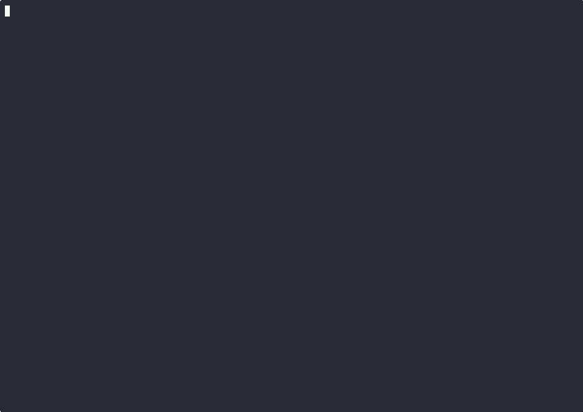

<!--
   Alice session                rule store                  Bob session
   =============               ============                ============
   npm install moment   --->   rule-card.json   --->   PreToolUse hook
         |                          ^                          |
         v                          |                          v
    user correction  ---- Stop hook capture                 BLOCKED
         |                                                     |
         +-----------> proof console <-----------+             |
                            |                   |             |
                            v                   v             |
                    evidence/ceo-summary.html <--+-------------+
                            |
                            v
                            CEO
-->

<div align="center">

# metrix-plugin

**Previous Claude Code made this mistake.<br/>
New Claude Code tried to repeat it.<br/>
TeamAgent blocked it.**

A Claude Code plugin marketplace that captures user corrections in one session and prevents the same mistake from repeating in the next.

[](docs/demo/teamagent-demo.gif)

<sub>Real interactive <code>claudefast</code> session in tmux — two distinct Claude Code sessions, real model round-trip, real PreToolUse denial rendered by the TUI. 72 s end to end (idle compressed). Cast file: <a href="docs/demo/teamagent-demo.cast"><code>teamagent-demo.cast</code></a>. Earlier mock recording archived at <a href="docs/demo/archive/"><code>docs/demo/archive/</code></a>.</sub>

</div>

---

## What is this

Built on the [TeamBrain](https://github.com/libz-renlab-ai/TeamBrain) idea: short-term agent memory becomes durable team policy.

```
┌─────────────────────────────────────────────────────────────────┐
│  Alice corrects Claude    → teamagent-memory captures rule card │
│  Bob retries 3 days later → teamagent-memory blocks via hook    │
│  CEO opens the dashboard  → teamagent-proof-console renders HTML│
│  Team-wide propagation    → teamagent-team-sync ships the rule  │
│  Third-party verdict      → bin/judge.sh + jq + ffprobe say PASS│
└─────────────────────────────────────────────────────────────────┘
```

## Install

```text
/plugin marketplace add LiuShiyuMath/metrix-plugin
/plugin install teamagent-memory@metrix-plugin
/plugin install teamagent-proof-console@metrix-plugin
/plugin install teamagent-team-sync@metrix-plugin
```

The hooks register themselves via each plugin's `hooks/hooks.json`. The rule store lives at `~/.teamagent/rules.jsonl`; the event log at `~/.teamagent/events.jsonl`.

## Three plugins

| Plugin | Category | Job |
|---|---|---|
| [`teamagent-memory`](plugins/teamagent-memory/) | memory | Capture corrections via Stop hook; block repeats via PreToolUse; inject rule context via UserPromptSubmit. |
| [`teamagent-proof-console`](plugins/teamagent-proof-console/) | observability | Render `evidence/ceo-summary.html` (4 verbatim anchor strings + before/after diff) from real captured events. `/teamagent-proof-console:proof` |
| [`teamagent-team-sync`](plugins/teamagent-team-sync/) | collaboration | SessionStart pulls team rules + writes `conflicts.jsonl` instead of overwriting; UserPromptSubmit suggests publish when the user wants to share. |

## Verify

`bin/judge.sh` is a third-party harness — bash + jq + ffprobe + `node --check` + `claudefast`. The LLM never self-judges; it can only read `judge.json` afterwards, in mechanical isolation via `--plugin-dir /tmp/empty`.

```text
bash bin/judge.sh           # runs three probes, writes judge.json, prints PASS / FAIL
bash bin/judge-verdict.sh   # ships judge.json to a blank-brain LLM judge under --plugin-dir /tmp/empty
```

Three probes:

| Probe | What it proves |
|---|---|
| `stream-json` | claudefast actually emits a parseable stream-json event source |
| `ab-plugin-dir` | A: empty plugin dir → no block. B: rule seeded → **block** with `permissionDecision: deny`. C: benign command → still passes. Causal A/B + selectivity. |
| `file-checks` | `rule-card.json` schema · `ceo-summary.html` ≥ 2 KB + 4/4 anchors · `node --check` for every hook · `git status --porcelain` clean · optional `ffprobe` on demo mp4 |

## Demo it yourself

The recording you see at the top of this README was generated by:

```text
bash demo/teamagent-demo.sh                                 # raw run, real hooks, isolated HOME
asciinema rec docs/demo/teamagent-demo.cast \
  --cols 120 --rows 36 \
  --command "bash demo/teamagent-demo.sh" --overwrite       # record
agg docs/demo/teamagent-demo.cast docs/demo/teamagent-demo.gif \
  --font-size 14 --speed 1.2 --idle-time-limit 1.5          # cast → gif
```

Try it locally — the script lives at [`demo/teamagent-demo.sh`](demo/teamagent-demo.sh) and exercises every hook for real (no LLM round-trip needed).

## Docs

- [`docs/duck-guidebook/index.html`](docs/duck-guidebook/index.html) — single-page Chinese guidebook for a non-coder CEO reader (鸭语 throughout, ten chapters, opens in a browser, zero build steps).
- [`docs/demo/teamagent-wild.gif`](docs/demo/teamagent-wild.gif) — real-machine 4-pane tmux recording with separate `HOME` / `CLAUDE_HOME` lanes.
- [`demo/teamagent-sandbox-server.cjs`](demo/teamagent-sandbox-server.cjs) — local clickable browser console that controls a real tmux sandbox; Alice is user-controlled and Leader watches changes.
- [`EVAL.md`](EVAL.md) — the tool-enforced eval contract. `claudefast --plugin-dir /tmp/empty` does the final read-only judging.
- [`plugins/*/README.md`](plugins/) — per-plugin user docs (hook contracts, file layouts, troubleshooting).
- [`probes/README.md`](probes/README.md) — judge probe specs and how to add a new one.

## Repo layout

```
metrix-plugin/
├── .claude-plugin/marketplace.json     ← catalog (3 plugins, version 0.1.0)
├── plugins/
│   ├── teamagent-memory/               ← 3 skills, 3 hook .cjs, bin/teamagent
│   ├── teamagent-proof-console/        ← 3 skills, /proof slash command
│   └── teamagent-team-sync/            ← 3 skills, 2 hook .cjs
├── evidence/                           ← rule-card.json, ceo-summary.html
├── bin/                                ← judge.sh, judge-verdict.sh
├── probes/                             ← stream-json.sh, ab-plugin-dir.sh, file-checks.sh
├── demo/                               ← teamagent-demo.sh (deterministic end-to-end)
├── docs/
│   ├── demo/                           ← teamagent-demo.cast + .gif
│   └── duck-guidebook/index.html       ← CEO-duck single-page guidebook
├── README.md                           ← (you are here)
└── EVAL.md                             ← third-party verdict contract
```

## License

MIT — see each plugin's manifest. Built by [@LiuShiyuMath](https://github.com/LiuShiyuMath), based on the [TeamBrain](https://github.com/libz-renlab-ai/TeamBrain) marketplace concept.
